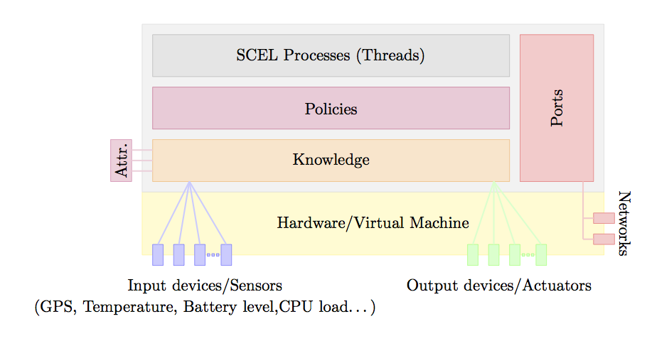

jResp is a Java framework that provides programmers with a set of APIs that simplify design, development and coordination of distributed systems. To cope with size, complexity and dynamism of contemporary software-intensive distributed systems jResp provides suitable programming abstractions to represent behaviors, knowledge and aggregations according to specific policies, and to support programming context-awareness, self-awareness and adaptation.

This project is a fork of the project started in the context of [EU Project ASCENS](http://www.ascens-ist.eu) that is still available [here](http://jresp.sourceforge.net).

# jResp architecture

A jResp system consists of a set of components executed over a distributed infrastructure. Components are implemented via the class ```Node```. The architecture of a node is shown in the following figure:



Nodes are executed over virtual machines or physical devices providing access to input/output devices and network connections. A node aggregates a knowledge repository, a set of running processes, and a set of policies. Structural and behavioral information about a node are collected into an interface via attribute collectors. Nodes interact via ports supporting both point-to-point and group-oriented communications.

## Knowledge

The interface ```KnowledgeManager``` identifies a generic knowledge repository and indicates the high-level primitives to manage pieces of relevant information coming from different sources. This interface contains the methods for withdrawing/retrieving/adding piece of knowledge from/to a repository. A knowledge manager based on Tuple Space is integrated is currently in jRESP.  Thus, items are defined as tuples, i.e. sequences of  Objects, that can be collected into a knowledge repository. They can be retrieved/withdrawn via pattern-matching through templates, consisting of a sequence of actual and formal fields.

External data can be collected into a knowledge repository via sensors. Each sensor can be associated to a logical or physical device providing data that can be retrieved by processes and that can be the subject of adaptation. Similarly, actuators can be used to send data to an external device or service attached to a node. This approach allows jRESP processes to control exogenous devices that identify logical/physical actuators.

The interface associated to a node is computed by exploiting attribute collectors. Each of this collector is able to inspect the local knowledge and to compute the value of the attributes. This mechanism equips a node with reflective capabilities allowing a component to self-project the image of its state on the interface. Indeed, when the local knowledge is updated the involved collectors are automatically activated and the node interface is modified accordingly.

## Network Infrastructure

Each Node is equipped with a set of ports for interacting with other components. A port is identified by an address that can be used to refer to other jRESP components. Each node can be addressed via a pair composed of the node name and the address of one of its ports. The abstract class ```AbstractPort``` implements the generic behaviour of a port. It implements the communication protocol used by jRESP components to interact with each other. Class ```AbstractPort``` also provides the instruments to dispatch messages to components. However, the methods used for sending messages via a specific communication network/media are abstract. The concrete classes defining specific kinds of ports extend AbstractPort to provide concrete implementations of the above outlined abstract methods, so to use different underlying network infrastructures (e.g., Internet, Ad-hoc networks,...).

Currently, four kinds of port are available: ```SocketPort```, ```ScribePort```, ```ServerPort``` and ```VirtualPort```. The first one implements point-to-point and group-oriented interactions via TCP and UDP, respectively. In particular, ```SocketPort``` implements group-oriented interactions in terms of a UDP broadcast. Unfortunately, this approach does not scale when the size of involved components increases. To provide a more efficient and reliable support to group-oriented interactions, jRESP provides the class ```ScribePort```. This class realises interactions in terms of the P2P and multicast protocols provided by [Scribe](http://www.freepastry.org/SCRIBE/default.htm) and [FreePastry](http://www.freepastry.org). A more centralized implementation is provided by ```ServerPort```. All messages sent along this kind of port pass through a centralize server that dispatches all the received messages to each of the managed ports. Finally, ```VirtualPort``` implements a port where interactions are performed via a buffer stored in memory. A VirtualPort is used to simulate nodes in a single application without relying on a specific network infrastructure.

## Behaviors

Behaviour of a component is defined via the abstract class ```Agent```, which provides the methods implementing the actions that can be used to interact with local knowledge and remote components. In fact, they can be used for generating fresh names, for instantiating new components and for withdrawing/retrieving/adding information items from/to shared knowledge repositories. The latter methods extend the ones considered in knowledge with another parameter identifying either the (possibly remote) node where the target repository is located or the group of nodes whose repositories have to be accessed. As previously mentioned, group-oriented interactions are supported by the communication protocols defined in the node ports and by attribute collectors.

## Policies

In jRESP policies can be used to regulate the interaction between the different internal parts of components and their mutual interactions. When a method of an instance of class ```Agent``` is invoked, its execution is delegated to the policy associated to the node where the agent is running. The policy can then control the execution of the action (for instance, by generating an exception when some access right has been violated) and, possibly, of related extra actions. By default, each node is instantiated with the policy allowing any operation. Different kinds of policies can be easily integrated in jRESP by implementing the interface ```IPolicy```.

# Gettin Started

The best way to develop applications with jResp is to use [Eclipse](https://eclipse.org). Below a brief description showing how set-up the environment:

1. Download and Install Eclipse;

2. Check if the ```gson``` plug-in is available in your distribution, if not install it via the [Orbit repository](https://www.eclipse.org/orbit/);

3. Create directory ```<projectbase>``` 

4. Go into your directory ```<projectbase>``` and clone the jresp repository with git:

```
cd <projectbase>
git clone https://github.com/michele-loreti/jResp.git
```

5. Run Eclipse and open and create a new workspace in 

```
<projectbase>/JRESP_WORKSPACE
```

6. Import all the projects in the folder ```<projectbase>/jResp```. Notice that it is convenient that the imported project *is not* copied  in the workspace.

If needed, you can update your jRESP installation you have to execute:

```
cd <projectbase>
git pull 
```

## Create a new jResp project

1. Create a New Plug-In Project (If you have a “Java project” you can assign to it “Plug-In Nature”)

2. Open the MANIFEST.MF file under META-INF folder and add ```org.cmg.jresp.core```, ```org.cmg.jresp.pastry```, ```org.cmg.jresp.simulation``` among the “Required Plug-ins"


## Export Executable Code

If you have an executable Java you can create an executable jar. 

1. Select your project and click the menu “File -> Export”

2. Select “Java -> Runnable JAR File"

3. Select your “Lunch configuration” and choose a ```<myjarfile>.jar``` name 

4. Tick the “Extract required libraries into generated JAR”

5. Press “Finish” button

After that you can execute you program by running

```
java -jar <myjarfile>.jar
```
